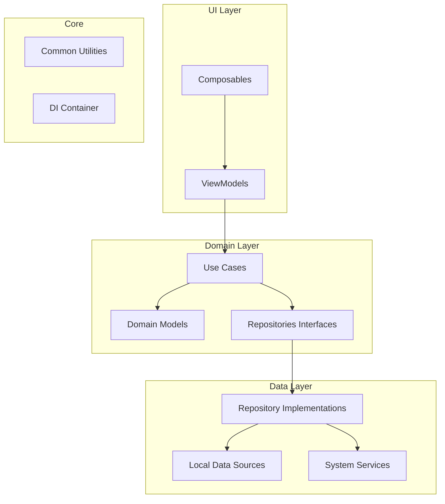
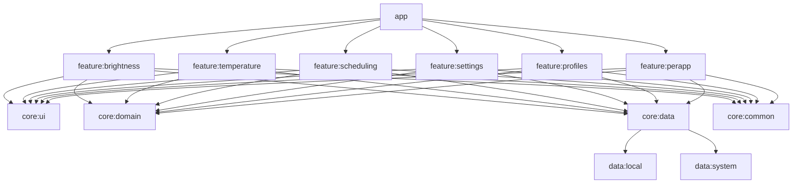

# RankerZ Screen Brightness App Architecture

## Overview

This document outlines the architectural design for the RankerZ screen brightness app, an advanced Android mobile application for screen brightness and color temperature control. The app will allow users to reduce screen brightness below Android's default minimum and include all features of F.lux plus innovative additions.

## Table of Contents

1. [High-Level Architecture (MVVM)](#1-high-level-architecture-mvvm)
2. [Module Structure and Major Components](#2-module-structure-and-major-components)
3. [Key Interfaces Between Components](#3-key-interfaces-between-components)
4. [Folder/Package Structure Recommendation](#4-folderpackage-structure-recommendation)
5. [Permissions and System Integration](#5-permissions-and-system-integration)
6. [Data Flow for Core Features](#6-data-flow-for-core-features)
7. [Architectural Considerations and Best Practices](#7-architectural-considerations-and-best-practices)

## 1. High-Level Architecture (MVVM)

The architecture follows the MVVM pattern with clean architecture principles for a scalable, maintainable codebase.

### Key Components in Each Layer:

1.  **UI Layer**:
    *   **Composables**: Screen UI components using Jetpack Compose
    *   **ViewModels**: Manage UI state and business logic for the composables

2.  **Domain Layer**:
    *   **Use Cases**: Encapsulate business logic operations
    *   **Domain Models**: Core business entities
    *   **Repository Interfaces**: Abstract data access requirements

3.  **Data Layer**:
    *   **Repository Implementations**: Concrete data access implementations
    *   **Local Data Sources**: Room database, DataStore, SharedPreferences
    *   **System Services**: Android system service interactions

4.  **Core Layer**:
    *   **Common Utilities**: Shared code across modules
    *   **DI Container**: Dependency injection setup (Hilt or Koin)

## 2. Module Structure and Major Components

The app is modularized for better scalability and separation of concerns:

### Major Components and Their Responsibilities:

#### App Module:
*   Main application entry point
*   Navigation architecture
*   Dependency injection setup
*   Global theme and styling

#### Feature Modules:
1.  **feature:brightness**
    *   Brightness control UI
    *   Brightness adjustment viewmodels and use cases
    *   Overlay service for reducing brightness below system minimum

2.  **feature:temperature**
    *   Color temperature control UI
    *   Temperature adjustment viewmodels and use cases
    *   Color filter implementations

3.  **feature:scheduling**
    *   Time-based scheduling UI
    *   Location-based adjustment management
    *   Scheduling algorithms and triggers

4.  **feature:settings**
    *   App-wide settings UI
    *   Settings management
    *   Permission handling UI

5.  **feature:profiles**
    *   User-defined profiles UI
    *   Profile management
    *   Profile switching logic

6.  **feature:perapp**
    *   Per-app settings UI
    *   App detection and monitoring
    *   App-specific setting application

#### Core Modules:
1.  **core:ui**
    *   Common UI components
    *   Theme definitions
    *   UI utilities and extensions

2.  **core:domain**
    *   Domain models
    *   Base use case classes
    *   Repository interfaces

3.  **core:data**
    *   Repository implementations
    *   Data source abstractions
    *   Data mappers

4.  **core:common**
    *   Extension functions
    *   Utility classes
    *   Constants

#### Data Modules:
1.  **data:local**
    *   Room database implementation
    *   DataStore implementation