*   SharedPreferences utilities

2.  **data:system**
    *   Display/screen service interactions
    *   Accessibility service implementation
    *   System settings modifications

## 3. Key Interfaces Between Components

```mermaid
classDiagram
    class BrightnessRepository {
        <<interface>>
        +getCurrentBrightness() : Flow<Float>
        +setBrightness(level: Float) : Result<Unit>
        +getMinimumAllowedBrightness() : Float
        +isOverlayRequired(level: Float) : Boolean
    }

    class ColorTemperatureRepository {
        <<interface>>
        +getCurrentColorTemperature() : Flow<Int>
        +setColorTemperature(temperature: Int) : Result<Unit>
        +getAvailableColorProfiles() : List<ColorProfile>
    }

    class SchedulingRepository {
        <<interface>>
        +getActiveSchedules() : Flow<List<Schedule>>
        +createSchedule(schedule: Schedule) : Result<Long>
        +updateSchedule(schedule: Schedule) : Result<Unit>
        +deleteSchedule(scheduleId: Long) : Result<Unit>
        +getLocationBasedSettings() : Flow<LocationSettings>
    }

    class AppProfileRepository {
        <<interface>>
        +getAppProfiles() : Flow<List<AppProfile>>
        +setAppProfile(packageName: String, settings: AppSettings) : Result<Unit>
        +getAppSettings(packageName: String) : Flow<AppSettings?>
    }

    class SystemPermissionsManager {
        <<interface>>
        +hasOverlayPermission() : Boolean
        +hasAccessibilityPermission() : Boolean
        +hasNotificationPermission() : Boolean
        +hasLocationPermission() : Boolean
        +requestOverlayPermission()
        +requestAccessibilityPermission()
    }

    class OverlayService {
        <<interface>>
        +showOverlay(opacity: Float)
        +hideOverlay()
        +updateOverlayOpacity(opacity: Float)
        +getOverlayStatus() : Flow<OverlayStatus>
    }
```



The interfaces above define clear contracts between layers, enabling:
*   Dependency inversion for testability
*   Clean separation between data providers and consumers
*   Modularity where implementations can change without affecting consumers

## 4. Folder/Package Structure Recommendation

```
com.rankerz.screenbrightness/
├── app/                              # Application module
│   ├── di/                           # Dependency injection
│   ├── navigation/                   # App navigation
│   ├─ ui/                           # Main activity and app container
│   └── services/                     # App-level services
│
├── feature/                          # Feature modules
│   ├── brightness/
│   │   ├── di/
│   │   ├── domain/
│   │   │   ├── model/
│   │   │   ├── repository/
│   │   │   └── usecase/
│   │   ├── data/
│   │   │   ├── repository/
│   │   │   └── source/
│   │   ├── service/                  # Brightness overlay service
│   │   └── ui/
│   │       ├── components/
│   │       ├── screens/
│   │       └── viewmodel/
│   │
│   ├── temperature/                  # Similar structure as brightness
│   ├── scheduling/                   # Similar structure
│   ├── settings/                     # Similar structure
│   ├── profiles/                     # Similar structure
│   └── perapp/                       # Similar structure
│
├── core/                             # Core modules
│   ├── ui/
│   │   ├── components/
│   │   ├── theme/
│   │   └── util/
│   ├── domain/
│   │   ├── model/
│   │   ├── repository/
│   │   └── usecase/
│   ├── data/
│   │   ├── repository/
│   │   └── mapper/
│   └── common/
│       ├── extension/
│       ├── util/
│       └── constants/
│
└── data/                             # Data modules
    ├── local/
    │   ├── dao/
    │   ├── database/
    │   ├── datastore/
    │   ├── entity/
    │   └── preferences/
    └── system/
        ├── service/
        ├── manager/
        ├── receiver/
        └── util/
```

This structure provides:
*   Clear separation of concerns
*   Discoverability for new developers
*   Scalability for adding new features
*   Alignment with modular architecture principles

## 5. Permissions and System Integration

### Required Permissions

```xml
<!-- Essential permissions -->
<uses-permission android:name="android.permission.SYSTEM_ALERT_WINDOW" />
<uses-permission android:name="android.permission.FOREGROUND_SERVICE" />
<uses-permission android:name="android.permission.RECEIVE_BOOT_COMPLETED" />

<!-- Optional based on features -->
<uses-permission android:name="android.permission.ACCESS_COARSE_LOCATION" />
<uses-permission android:name="android.permission.QUERY_ALL_PACKAGES" />
<uses-permission android:name="android.permission.BIND_ACCESSIBILITY_SERVICE" />